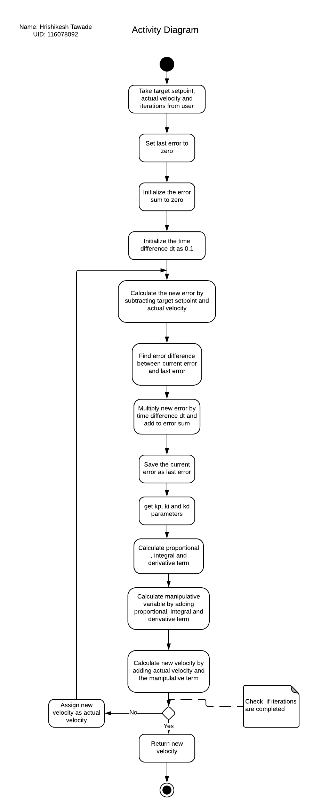
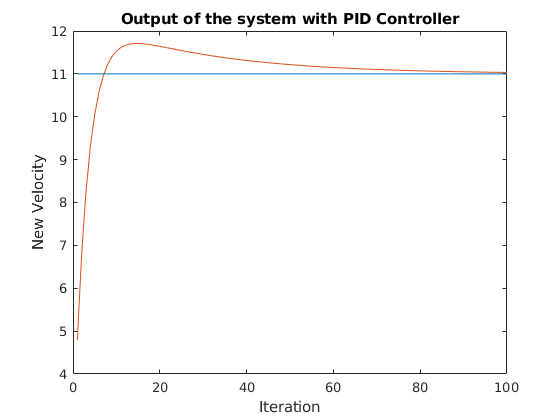
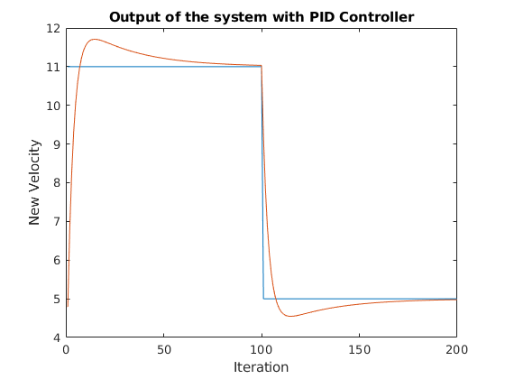

# C++ Boilerplate
<p align="center">
 
[](https://travis-ci.org/hrishikeshtawade04/cpp-boilerplate-2)
[](https://coveralls.io/github/hrishikeshtawade04/cpp-boilerplate-2?branch=GMock_Extra_Credit_Hrishikesh_Tawade)
[](https://opensource.org/licenses/BSD-3-Clause)

</p>

## Overview

Simple PID Controller C++ project with:

- cmake
- googletest
- googlemock

## Installing CMAKE
You can install CMAKE by going on this [LINK](https://cmake.org/install/).

## Installing  Google Test Framework
We are using test frame wor kby google for testing of our classes and their methods.
You can install Google Test Framework by going on this  [LINK](https://www.eriksmistad.no/getting-started-with-google-test-on-ubuntu/).

## Installing  Google Mock
We are using the Google Mock Framework with the Google Test Framework to create mock clases and unit test there parent classes.
```
 sudo apt-get install -y google-mock
 ```
## Notes
- This repository implements a simple PID control algorithm which takes in target velocity, initial velocity and number of iterations as inputs and returns final velocity as output for the given kp, ki and kd parameters set by the user.
- The user can use this implementation to check whether the PID controller converges for the given number of iterations.

## UML Diagrams
The  UML Diagrams are as follows.
- Class Diagram
<p align="center">
<a target="_blank">
</a>
</p>

- Activity Diagram for compute function
<p align="center">
<a target="_blank">
</a>
</p>

## Expected Output after test

- Expected convergence test performance
<p align="center">
<a target="_blank">
</a>
</p>

- Expected bump test performance
<p align="center">
<a target="_blank">
</a>
</p>

## Standard install via command-line
```
git clone -b GMock_Extra_Credit_Hrishikesh_Tawade https://github.com/hrishikeshtawade04/cpp-boilerplate-2.git
cd <path to repository>
mkdir build
cd build
cmake ..
make
```
## Program running command
Enter following command to run the PID controller program.
```
./app/shell-app
```
## Using Google Mock
There are two classes in the program namely PIDController class and the Parameters Class. The PIDController Class consumes Parameters class to get Kp, Ki and Kd which the Parameters class provides. So in order to carryout the unit test of class PIDController I have mocked the Parameters class wherein the interface is rigorously tested using following features. The mocked class can be seen below.
```
class MockParameters : public Parameters {
 public:
  MOCK_METHOD0(getKp, double());
  MOCK_METHOD0(getKd, double());
  MOCK_METHOD0(getKi, double());
};
```
The MOCK_METHOD(n) specifies the methods to be mocked wherein the n denotes the number of arguments to be passed to the method. The first argument of MOCK_METHOD is the method name and second is the method return type.

Below is an example of the convergence test of PIDController. In this case 'para' is the object of mocked Parameters class.The mocked class can be seen in below code.It has been passed to the instancePID object of PIDController class. The "EXPECT_CALL" command expects the getKp(),getKi(), and getKd() to be called exactly 100 times and will return values specified in Return section. Thus the tests are made stringent.

```
TEST(PIDControllerTest, convergenceTest) {
  MockParameters para;
  EXPECT_CALL(para, getKp())  /// #1
      .Times(100).WillRepeatedly(Return(0.6));
  EXPECT_CALL(para, getKi())  /// #2
      .Times(100).WillRepeatedly(Return(0.1));
  EXPECT_CALL(para, getKd())  /// #3
      .Times(100).WillRepeatedly(Return(0.003));
  PIDController instancePID(&para);
  EXPECT_NEAR(15.0, instancePID.compute(15.0, 1.0, 100), 1.0);
}
```

## Test running commands
Running the following command you can test the 2 unit tests running on PIDController Class.
```
cd <path to build folder>
./test/cpp-test
```
## Generating Doxygen Documentation
```
sudo apt-get install flex
git clone https://github.com/doxygen/doxygen.git
cd doxygen
mkdir build
cd build
cmake -G "Unix Makefiles" ..
make
sudo make install
```
After installation run following command to generate the doxygen configuration file.
```
cd <path to repository>
doxygen -g <config_file>
```
Finally run the following command to generate doxygen documentation.
```
doxygen <config_file>
```
