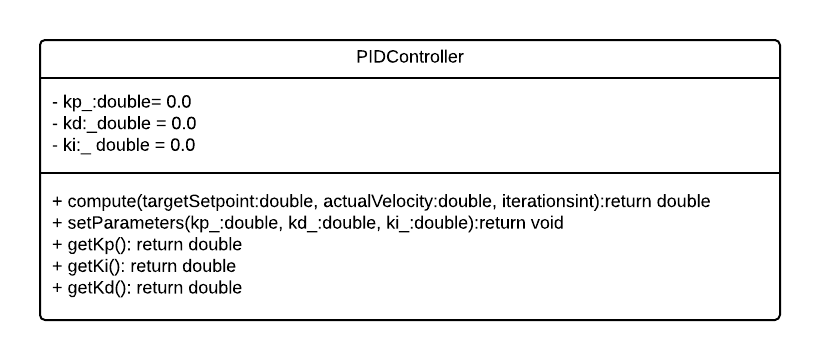
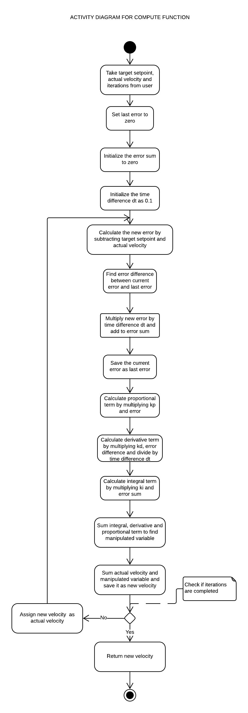
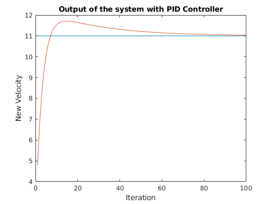
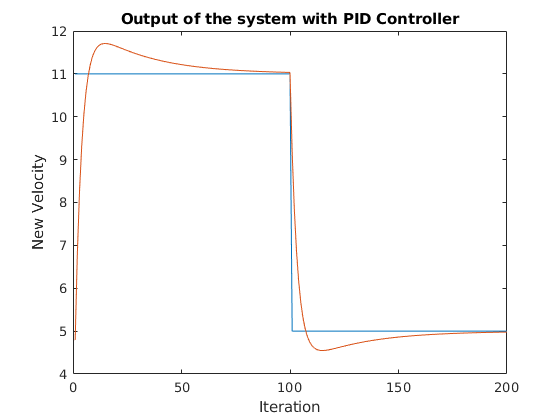

# C++ Boilerplate
[](https://travis-ci.org/sauravkdeo/cpp-boilerplate)
[](https://coveralls.io/github/sauravkdeo/cpp-boilerplate?branch=master)
---

## Authors of Part 1

- Driver : Saurav Kumar (UID: 116139960) (Github: sauravkdeo )
- Navigator : Hrishikesh Gopal Tawade (UID: 116078092) (github: hrishikeshtawade04 )

## Authors of Part 2

- Driver: Ashish Patel (UID: 115730625) (GitHub: Learner1729)
- Navigator: Yash Shah (UID: 115710498) (GitHub: ysshah95)

## Overview

Simple PID Controller C++ project with:

- cmake
- googletest

## Notes
- This repository implements a simple PID control algorithm which takes in target velocity, initial velocity and number of iterations as inputs and returns final velocity as output for the given kp, ki and kd parameters set by the user.
- The user can use this implementation to check whether the a PID controller converges for a given number of iterations and PID parameters.

## TODO List
The following to-do list was made after team discussion and of comments based on other teams:
- Use inline constructor feature used in c++11.
- PID algorithm variables like error sum and difference in error should be class variables instead of local method variables to retain there values.
  This will facilitate easy integration with other classes and control loops in main function.
- There should be a test which asserts time difference dt should not be equal to zero.
- The code should include condition to return an error value to notify that dt is set to zero which is not acceptable.
- Edit the main function to remove stub implementations.
- The test for convergence and bump should replace the expected value mentioned as constant directly with the targetValue variable.

## UML Diagrams
- Class Diagram
<p align="center">
<a target="_blank">
</a>
</p>

- Activity Diagram for compute function
<p align="center">
<a target="_blank">
</a>
</p>

## Expected Output after test

- Expected convergence test performance
<p align="center">
<a target="_blank">
</a>
</p>

- Expected bump test performance
<p align="center">
<a target="_blank">
</a>
</p>

## Standard install via command-line
```
git clone --recursive https://github.com/dpiet/cpp-boilerplate
cd <path to repository>
mkdir build
cd build
cmake ..
make
Run tests: ./test/cpp-test
Run program: ./app/shell-app
```

## Building for code coverage (for assignments beginning in Week 4)
```
sudo apt-get install lcov
cmake -D COVERAGE=ON -D CMAKE_BUILD_TYPE=Debug ../
make
make code_coverage
```
This generates a index.html page in the build/coverage sub-directory that can be viewed locally in a web browser.

## Working with Eclipse IDE ##

## Installation

In your Eclipse workspace directory (or create a new one), checkout the repo (and submodules)
```
mkdir -p ~/workspace
cd ~/workspace
git clone --recursive https://github.com/dpiet/cpp-boilerplate
```

In your work directory, use cmake to create an Eclipse project for an [out-of-source build] of cpp-boilerplate

```
cd ~/workspace
mkdir -p boilerplate-eclipse
cd boilerplate-eclipse
cmake -G "Eclipse CDT4 - Unix Makefiles" -D CMAKE_BUILD_TYPE=Debug -D CMAKE_ECLIPSE_VERSION=4.7.0 -D CMAKE_CXX_COMPILER_ARG1=-std=c++14 ../cpp-boilerplate/
```

## Import

Open Eclipse, go to File -> Import -> General -> Existing Projects into Workspace ->
Select "boilerplate-eclipse" directory created previously as root directory -> Finish

# Edit

Source files may be edited under the "[Source Directory]" label in the Project Explorer.


## Build

To build the project, in Eclipse, unfold boilerplate-eclipse project in Project Explorer,
unfold Build Targets, double click on "all" to build all projects.

## Run

1. In Eclipse, right click on the boilerplate-eclipse in Project Explorer,
select Run As -> Local C/C++ Application

2. Choose the binaries to run (e.g. shell-app, cpp-test for unit testing)


## Debug


1. Set breakpoint in source file (i.e. double click in the left margin on the line you want
the program to break).

2. In Eclipse, right click on the boilerplate-eclipse in Project Explorer, select Debug As ->
Local C/C++ Application, choose the binaries to run (e.g. shell-app).

3. If prompt to "Confirm Perspective Switch", select yes.

4. Program will break at the breakpoint you set.

5. Press Step Into (F5), Step Over (F6), Step Return (F7) to step/debug your program.

6. Right click on the variable in editor to add watch expression to watch the variable in
debugger window.

7. Press Terminate icon to terminate debugging and press C/C++ icon to switch back to C/C++
perspetive view (or Windows->Perspective->Open Perspective->C/C++).


## Plugins

- CppChEclipse

    To install and run cppcheck in Eclipse

    1. In Eclipse, go to Window -> Preferences -> C/C++ -> cppcheclipse.
    Set cppcheck binary path to "/usr/bin/cppcheck".

    2. To run CPPCheck on a project, right click on the project name in the Project Explorer
    and choose cppcheck -> Run cppcheck.


- Google C++ Sytle

    To include and use Google C++ Style formatter in Eclipse

    1. In Eclipse, go to Window -> Preferences -> C/C++ -> Code Style -> Formatter.
    Import [eclipse-cpp-google-style][reference-id-for-eclipse-cpp-google-style] and apply.

    2. To use Google C++ style formatter, right click on the source code or folder in
    Project Explorer and choose Source -> Format

[reference-id-for-eclipse-cpp-google-style]: https://raw.githubusercontent.com/google/styleguide/gh-pages/eclipse-cpp-google-style.xml

- Git

    It is possible to manage version control through Eclipse and the git plugin, but it typically requires creating another project. If you're interested in this, try it out yourself and contact me on Canvas.
